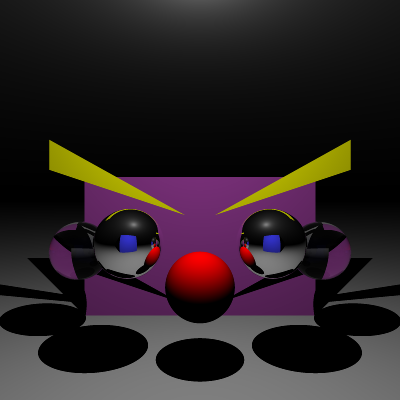

# Ray Tracer in C#

##### Stage 1

- [x] Stage 1.1 - Implement vector mathematics
- [x] Stage 1.2 - Fire a ray for each pixel
- [x] Stage 1.3 - Calculate ray-entity intersections
- [x] Stage 1.4 - Output primitives as solid colours

##### Stage 2

- [x] Stage 2.1 - Diffuse materials
- [x] Stage 2.2 - Shadow rays
- [x] Stage 2.3 - Reflective materials
- [x] Stage 2.4 - Refractive materials
- [x] Stage 2.5 - The Fresnel effect
- [x] Stage 2.6 - Anti-aliasing

##### Stage 3

- [ ] Option A - Emissive materials (+6)
- [ ] Option B - Ambient lighting/occlusion (+6)
- [ ] Option C - OBJ models (+6)
- [ ] Option D - Glossy materials (+3)
- [ ] Option E - Custom camera orientation (+3)
- [ ] Option F - Beer's law (+3)
- [ ] Option G - Depth of field (+3)

## Final scene render

Be sure to replace `./images/final_scene.png` with your final render so it shows up here:



This render took **0** minutes and **40** seconds on my PC.

```
dotnet run -- -f tests/models/final_scene.txt -o output.png -w 400 -h 400 -x 4
```

###### Sample 1

```
dotnet run -- -f tests/sample_scene_1.txt -o images/sample_scene_1.png -x 4
```

<p float="left">
  
   
</p>

###### Sample 2

```
dotnet run -- -f tests/sample_scene_2.txt -o images/sample_scene_2.png -x 4
```

<p float="left">
  
   
</p>

## References

Working through a ray tracer, from the head of the xbox games studio: https://www.linkedin.com/pulse/writing-simple-ray-tracer-c-matt-booty/

_Ray Tracing in a Weekend_: https://raytracing.github.io/

Great walkthrough of some of the basic maths: https://blog.scottlogic.com/2020/03/10/raytracer-how-to.html

Scratchapixel:
https://www.scratchapixel.com/lessons/3d-basic-rendering/introduction-to-ray-tracing/how-does-it-work
https://www.scratchapixel.com/lessons/3d-basic-rendering/ray-tracing-generating-camera-rays/generating-camera-rays
https://www.scratchapixel.com/lessons/3d-basic-rendering/introduction-to-shading/reflection-refraction-fresnel
https://www.scratchapixel.com/lessons/3d-basic-rendering/ray-tracing-rendering-a-triangle/ray-triangle-intersection-geometric-solution

Kyle Halladay:
http://kylehalladay.com/blog/tutorial/math/2013/12/24/Ray-Sphere-Intersection.html
